# Meals App

Simple meals app. This project is assignment 2 in IDATA2503 - Mobile applications course at NTNU. Below is the documentation required for the assignment.

In this application, a user can perform a range of actions:

- As an end-user, I possess the ability to explore meals categorized by type to facilitate the discovery of dishes I intend to prepare.
- One of the pivotal features is the capacity to store a meal as one of my favorites, ensuring swift access.
- Similarly, I have the ability to remove meals from my favorites list if my culinary preferences evolve.
- The integration of filters, tailored to dietary needs, is a noteworthy feature.
- To keep track of personal preferences, I can assign ratings to the meals I've prepared.
- A historical record of completed meals is maintained to recall previous culinary achievements.

## Application Architecture

The core of my application is encapsulated within the MealsApp widget, serving as the root of my widget hierarchy. It consists of the MaterialApp widget with the home set to TabsScreen, implemented as a ConsumerStatefulWidget. This main screen incorporates two distinct tabs: CategoriesScreen and FavoritesScreen, both realized as StatelessWidgets.

- CategoriesScreen presents a list of meal categories that are interactive. Upon interaction, users are seamlessly redirected to the MealsScreen.
- The FavoritesScreen also navigates the user to the MealsScreen, exhibiting meals labeled as favorites.

Additionally, the application encompasses a user-friendly drawer offering three navigation alternatives: "Meals," "Settings," and "Completed." "Meals" promptly closes the drawer, "Settings" launches a novel screen, FilterScreen, enabling users to configure meal filters within categories, while "Completed" showcases a comprehensive listing of meals marked as completed and rated.
Well-Structured Folders

To maintain code organization and modularity, my application adheres to the following folder structure:

- main.dart functions as the initial entry point.
-  The primary application widget class, meals_app.dart, governs the core functionalities.
- All distinct screens are systematically categorized under the "screens" folder.
- Widgets employed throughout the app are systematically organized in the "widgets" folder.
- Data models utilized are housed in the "models" folder.
- For efficient state management, the "providers" folder is meticulously maintained.
- Data-related functions and services are neatly organized within the "data" folder.

## A Glimpse of the Classes

  

## Enhanced Functionality

To enhance the user experience, I've added an extra feature - a "Reviewed" navigation option in the app's drawer. Also, when you're checking out meal details, you'll see a button called "Add a Rating." It's hidden if a meal has already been rated. This feature makes it easier to manage meal ratings and keeps your culinary journey organized. You can also delete a meal from the "Reviewed" screen using the trash icon button.

## Learning from the other person related to the assignment and their style of working?

In our peer review group, we each tackled our own projects with the same assignment, and throughout our collaboration, we capitalized on our respective strengths, fostering an environment of open communication and cooperation. This experience highlighted the value of students with varying skill levels working together, learning from one another, and leveraging each other's strengths to achieve a common goal.

## Review of other students code
The comments on the code can be found in their [repository](https://github.com/Kim3n/meals-app/pull/1)
